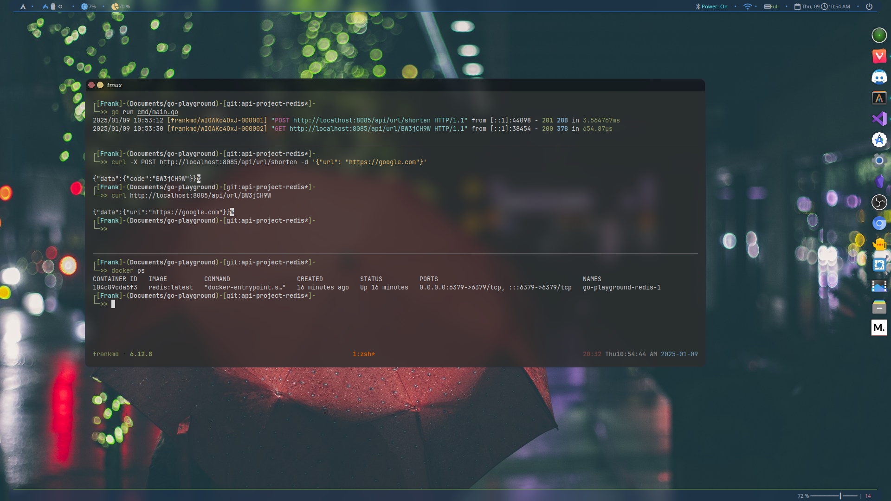

# URL Shortener API

This project is a URL Shortener API built with Go (Golang). The API allows users to shorten URLs and retrieve the original URLs using a generated code. The project follows a modular structure, making it easy to scale and maintain.

---

## Features

- **Shorten URLs:** Generate a shortened version of a long URL.
- **Retrieve Original URLs:** Fetch the original URL using a unique code.
- **Error Handling:** Includes robust error handling for invalid or expired codes.
- **Redis Integration:** Utilizes Redis for fast and efficient data storage.

---

## Project Structure

```
├── internal
│   ├── api-project
│   │   ├── handler.go        # Contains HTTP handlers for API endpoints
│   │   └── get_shortened_url.go  # Logic to handle retrieving original URLs
│   ├── store
│   │   ├── store.go          # Interface and implementation for data storage
├── main.go                   # Entry point of the application
├── go.mod                    # Go module definition
├── go.sum                    # Dependency lock file
```

---

## Installation and Setup

1. Ensure you have Go installed on your machine.

2. Clone this repository:
   ```
   git clone https://github.com/Frankdias92/go-playground 
   git switch api-project-redis
   ```
3. Install dependencies:
   ```bash
   go mod tidy
   ```
4. Run the application:
   ```bash
   go run cmd/main.go
   ```

---

## API Endpoints

### 1. Shorten URL
**POST** 
   ```bash
   curl -X POST http://localhost:8085/api/url/shorten -d '{"url": "https://github.com"}'
   ```

**Response:**
   ```bash
   {"data":{"code":"BW3jCH9W"}}
   ```

### 2. Get Original URL
**GET** 
   ```bash
   curl http://localhost:8085/api/url/{code}
   ```
**Response:**
   ```bash
   {"data":{"url":"https://google.com"}}
   ```

